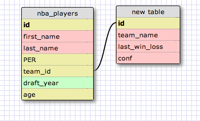

#Schema

I created two tables here: nba_players and nba_teams. The tables are joined at nba_players.team_id (primary key) = nba_teams.id (foreign key). I created a visual using the Socrates tool:

The code for each schema is as follows:

<pre><code>
CREATE TABLE nba_players 
	(id INTEGER PRIMARY KEY AUTOINCREMENT,                                           	first_name VARCHAR(64) NOT NULL,
	last_name  VARCHAR(64) NOT NULL, 
	per INTEGER, team_id, 
	draft_year INTEGER, 
	age INTEGER);

CREATE TABLE nba_teams 
	(id INTEGER PRIMARY KEY AUTOINCREMENT,                                                                       	 team_name VARCHAR(64) NOT NULL,
	 wins INTEGER, 
	 losses INTEGER, 
	 conf VARCHAR(64) NOT NULL);
</pre></code>

I present the code, individual tables and joined tables appearing in my terminal in [my_solution.md](my_solution.md).

