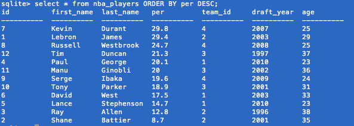
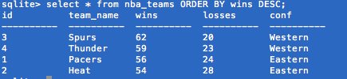
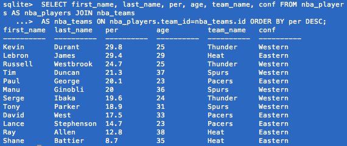

<!-- ## Show the terminal output here.  -->

#Terminal Output

**nba_players** (sorted by John Hollinger's PER rating: note that I randomly picked 12 players from the four teams that made their respective conference finals - all metrics are as of 2013-14 season):

**nba_teams** (sorted by 2013-14 wins: again, note I picked the four teams that made their respective conference finals):

**The joined tables**:

